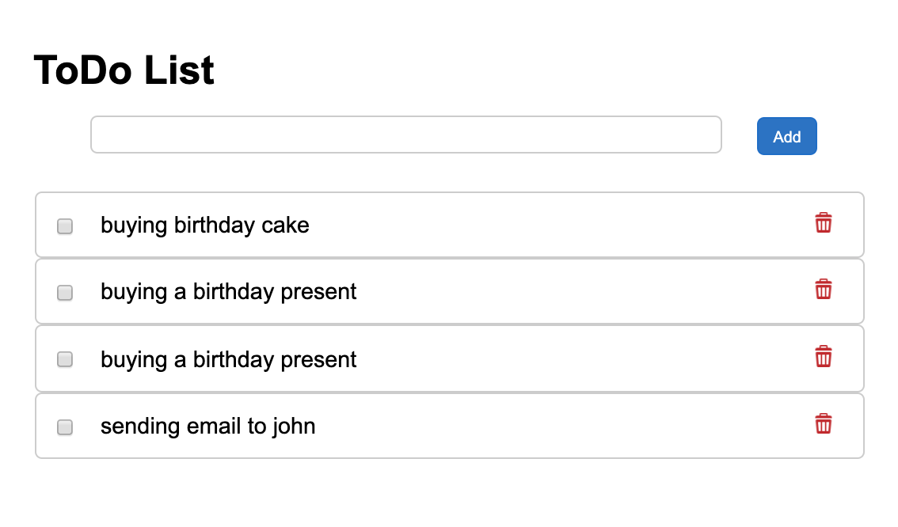

## TodoList App
With this To-Do list app you won't forget anything anymore! You can add a task and of course delete it when you have completed it.

###### Clone of download het project van Github. Je kunt gelijk starten door index.html te openen.

### Project purpose
The purpose of the project is to familiarize yourself with RESTful API, Promises (Async / await, Fetch), Vanilla Javascript, DOM manipulation and HTML / CSS. The App uses a database (external server) and through RESTFul requests the app can create tasks, show tasks and delete tasks. The app was created in the third week of the training.

### Project requirements
- [x] As a user I want to see an input field in which I can fill in my task.
- [x] As a user I can press a button with the text "Add Task" which will add the task to the list.
- [x] As a user I can click on a the trash icon and which removes the selected task from the list.

### Credits
To the lovely people of Winc Academy.
